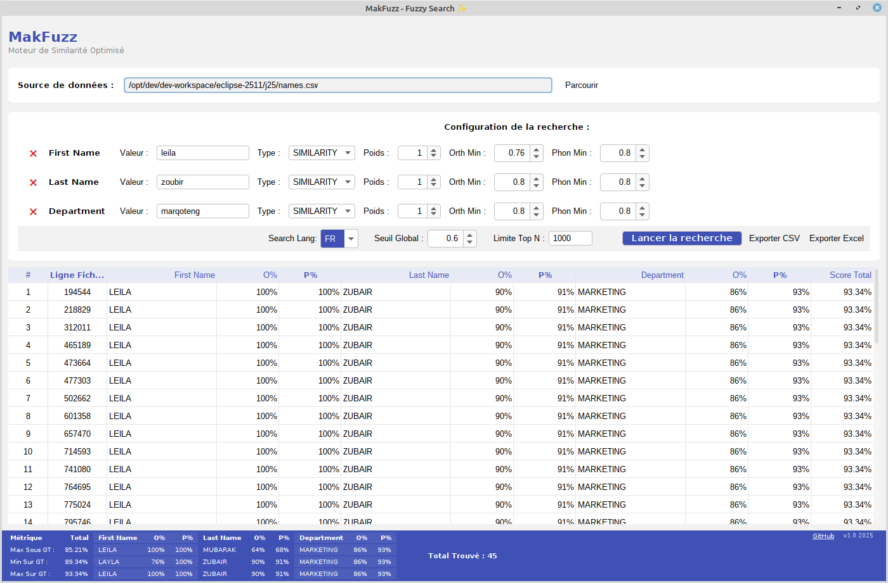

# 🧶 makfuzz - Simplifying Your Data Matching Needs

---

## 🚀 What is MakFuzz?

**MakFuzz** is a powerful, desktop-based fuzzy search utility designed to help you clean your data and remove duplicates. Whether you need to tidy up customer records, match messy lists, or search for names that sound similar, MakFuzz makes it easy.

This application uses advanced techniques to improve matching accuracy. It combines **Spelling Similarity** (how it looks) with **Phonetic Similarity** (how it sounds). This gives you the best results when searching for similar entries, ensuring you find what you need quickly.

---

## ✨ Key Features

### 🧠 Dual-Core Engine
- **Spelling Strategy**: Uses `Jaro-Winkler` distance to catch typos and visual similarities.
- **Phonetic Search**: Matches names based on how they sound, making it easier to find similar entries.

### 🗂️ Cross-Platform Support
- Works on Windows, macOS, and Linux, so you can use it no matter your operating system.

### 📊 CSV Processing
- Easily import and export data in CSV format. Clean your data effortlessly.

### 🎯 Data Quality Assurance
- Helps in maintaining high-quality data by identifying duplicates and inconsistencies.

### 💾 Excel Export
- Export your cleaned data directly to Excel for further analysis or reporting.

---

## 🌍 Getting Started

To get started with MakFuzz, first, make sure your computer meets the following system requirements:

- **Operating System**: Windows 10 or later, macOS 10.14 or later, or any recent Linux distribution.
- **Java**: Version 17 or higher installed on your system.

## 📥 Download & Install

1. Click the button below to visit the downloads page:

   

2. On the Releases page, look for the latest version.

3. Download the file appropriate for your operating system. 

4. Once the download is complete, open the file and follow the on-screen instructions to install MakFuzz.

5. After installation, launch the MakFuzz application to start cleaning your data!

---

## 📖 How to Use MakFuzz

1. **Import Data**: Start by importing your CSV file containing the data you wish to clean. Click on the "Import" button and select your file.

2. **Set Parameters**: Choose the criteria for matching, such as the level of similarity needed.

3. **Run the Match**: Click "Start Matching" to begin the process. MakFuzz will analyze your data and provide a list of matches.

4. **Review & Export**: Review the results. You can delete duplicates or keep them. When done, export your cleaned data back to a CSV or Excel format.

---

## 🛠️ Troubleshooting

If you encounter issues while using MakFuzz, consider the following steps:

- **Java Not Found**: Ensure that Java 17 or higher is installed. You can download it from the [official Oracle site](https://www.oracle.com/java/technologies/javase-jdk17-downloads.html).

- **File Format Issues**: Ensure your CSV file is formatted correctly. The first row should contain headers.

- **Performance**: If the application runs slowly, try reducing the data size or closing other applications.

---

## 🤝 Community Support

Join the community of MakFuzz users! You can find help and share experiences by visiting our discussion forum on the [MakFuzz GitHub page](https://github.com/Booster254/makfuzz/issues).

---

## 📜 License

MakFuzz is open-source software. You can use, modify, and share it according to the terms of the [MIT License](LICENSE).

Feel free to contribute by reporting issues or submitting pull requests on GitHub. Your feedback helps us improve the software!

---

For further details, questions, or suggestions, you can contact the project maintainers via the GitHub repository, or create an issue for support. Thank you for choosing MakFuzz!